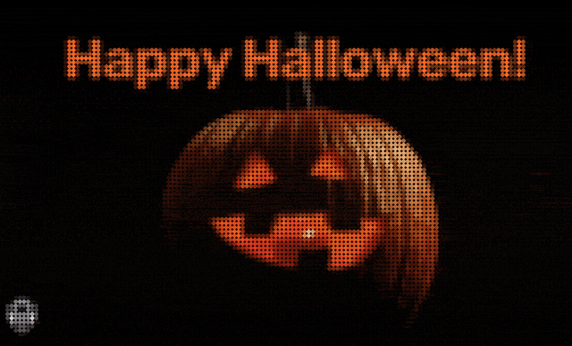

# RGBMatrixEmulator-animation

<p align="center">
  
</p>

Play animated GIFs on RGB LED matrix using
[RGBMatrixEmulator](https://github.com/ty-porter/RGBMatrixEmulator).

This project allows you to display animated GIF collections on an emulated RGB
LED matrix. GIFs are automatically downloaded from [Giphy](https://giphy.com/)
and resized to fit your matrix dimensions.

## How it works

To create a realistic LED matrix effect, the images are processed in two steps:

1. **Downscaling**: GIFs are resized to match the LED matrix dimensions
   (SCREEN_WIDTH / LED_PIXEL_SIZE × SCREEN_HEIGHT / LED_PIXEL_SIZE)
2. **Upscaling**: Each LED pixel is then enlarged to LED_PIXEL_SIZE, creating
   the pixelated LED effect

**Example**: With a 1920×1080 screen and LED_PIXEL_SIZE=30:

- The virtual LED matrix will be 64×36 LEDs (1920/30 × 1080/30)
- Each GIF is downscaled to 64×36 pixels
- Then upscaled back, with each pixel displayed as a 30×30 block, filling the
  screen

The screen resolution is needed to calculate the optimal LED matrix dimensions
that will fit your display.

## Usage

```bash
# Get screen resolution information (Can return multiple screens resolution)
just get-resolution

# Download and/or resize
just download <THEME_NAME> <SCREEN_WIDTH> <SCREEN_HEIGHT> <LED_PIXEL_SIZE>

# Animate the GIFs
just animate <THEME_NAME> <SCREEN_WIDTH> <SCREEN_HEIGHT> <LED_PIXEL_SIZE>
```

## GIFs themes

- [Halloween](./themes/halloween/README.md)
